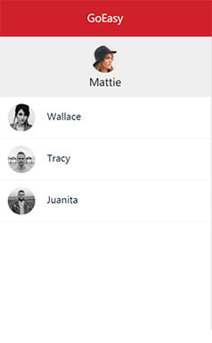
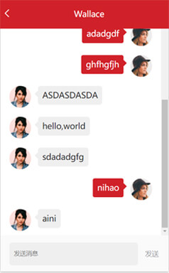

# 手把手教你用GoEasy实现Websocket IM聊天       
本文会持续更新，最新版本请访问https://github.com/GoEasySupport/goeasy-chat-demo    

经常有朋友问起GoEasy如何实现IM，今天就手把手的带大家从头到尾用GoEasy实现一个完整IM聊天，全套代码已经放在了github。

今日的前端技术发展可谓百花争鸣，为了确保本文能帮助到使用任何技术栈的前端工程师，Demo的源码实现上选择了最简单的HTML+JQuery的方式，所以,不论您是准备用Uniapp开发移动APP，还是准备写个小程序，不论你喜欢用React还是VUE，还是React-native或ionic, 或者您直接用原生Javascript和Typescript，都是可以轻松理解，全套代码已经放在github上了，下载后不需要搭建任何环境，直接用浏览器打开，就可以用来聊天了。        
    
  

作为一名程序员，在编码之前，首先要做的当然是架构设计！什么？确认不是装逼？当然，别忘了星爷的那句话：我是一名程序员！没有思想的程序员，跟咸鱼有什么区别呢？   

咳咳咳，正文开始：

**首先我们代码层将整个功能分为四层：**

1. 华丽的展示层（index.html）：你们负责功能优雅强大，我负责貌美如花。展示层其实就是纯静态的html，显示界面，高端点说，就是负责人机交互的。
2. 承上启下的控制层（controller.js）:  控制层作用就是接受页面操作的参数，调用service层，根据页面的操作指令或者service层的反馈，负责对页面的展示做出控制。不可以编写任何与展示逻辑无关的代码，也就是不能侵入任何业务逻辑。衡量这一层做的好不好的的标准，就是假设删掉controller和view层，service能准确完整的描述所有的业务逻辑。
3. 运筹帷幄的关键核心业务层（service.js）: 接受controller层的指令，实现业务逻辑，必要时候调用goeasy提供网络通讯支持，或调用restapi层完成数据的查询和保存。这一层包含所有的业务逻辑，任何业务逻辑相关的代码，都不可以漏到其他层，确保只要service存在，整个项目的灵魂就存在，确保service层完全是原生代码实现业务逻辑，而没有类似于vue或者小程序前端框架的语法和代码渗入，从而达到service层能够在任何前端框架通用。
4. 神通广大的服务器交互层（restapi.js）: 根据传入的参数完成服务器端接口的调用，来实现数据查询或、修改或保存，并且返回结果，不参与任何业务逻辑。在实践中大部分是负责发送http请求和服务器交互。

分层的目标就是为了确保除了在核心业务层以外的其他层次能够被轻易的替换。举例：我们当前的版本是使用html+jquery完成，如果希望再开发一个Uniapp实现的小程序或者app，只需要用Uniapp画个新外壳，对controller层做一些修改，就可轻松完成一个小程序或者APP版的IM聊天，不需要对service和restapi做任何修改 。同理，如果服务器端发生变化，或者更换了与服务器的交互方式，只需要对restapi做出修改，其他三层则不受任何影响。

OK, 有了如此清晰而优秀的代码结构分层设计，就差一段优雅的代码来实现了。

**运行步骤：**       
1. 在imservice.js里将appkey替换为您自己的common key
2. 不用搭建任何环境，在浏览器里直接打开index.html，就可以运行      
2. 在restapi.js 里 可以找到用户名和密码     
3. 部分高级功能，默认是关闭的，可以在我的应用->查看详情，高级功能里自助开通~
